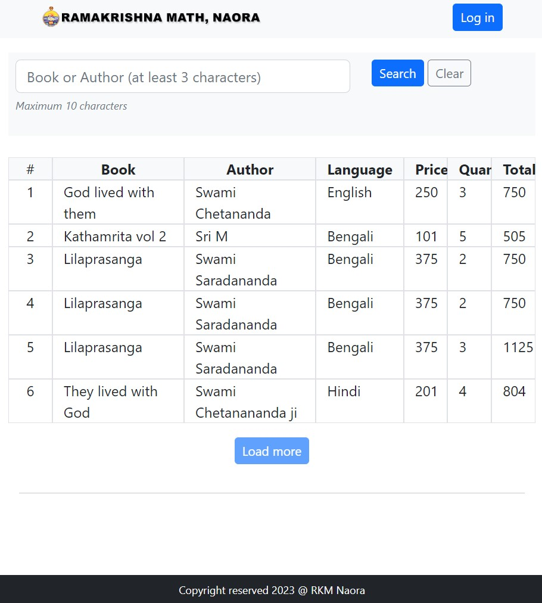
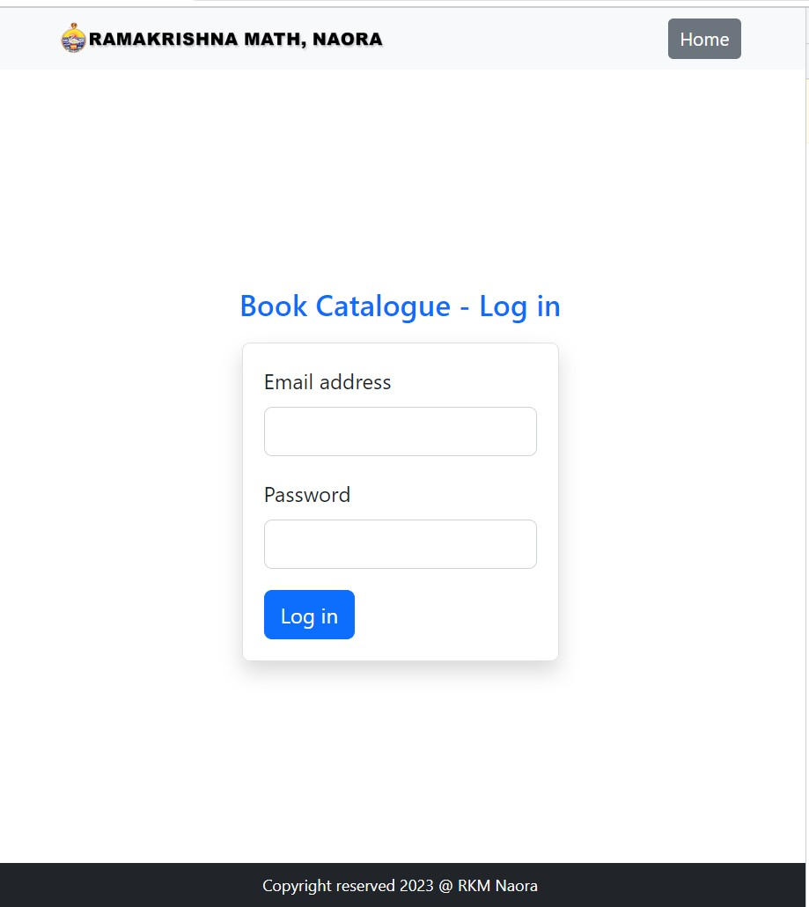
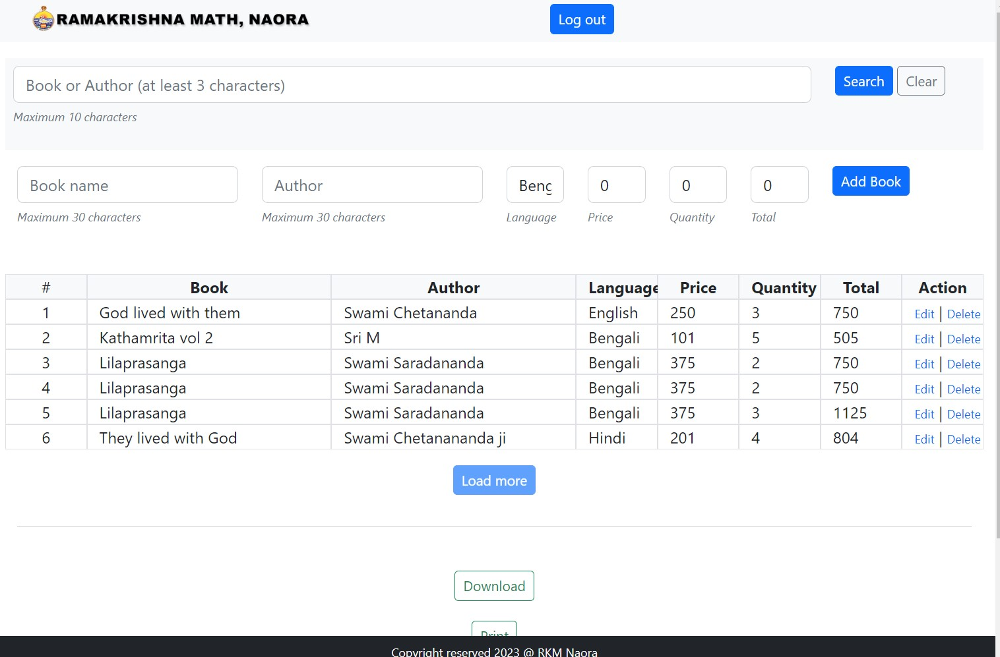

# RKM Naora Book Catalog

### How to run the project?

### Library used

1. React (18.2)
2. Typescript
3. Vite
4. React bootstrap
5. Firebase Auth
6. Firestore database
7. Excel integration
8. PDF integration

### Features

1. CRUD Books
2. Search
3. Export to excel
4. Print with pdf
5. Minimalist and clean view

### Technical Features

1. Completely responsive in all break points - xs, sm, md, xl
2. React latest version 18.2
3. React build is using esbuild (fastest)
4. Typescript

### General view

### Login view

### Logged in view

